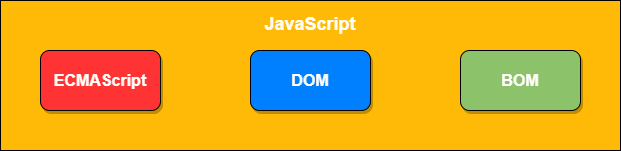

# JS自学笔记 (The Study Record of JavaScript)

## JavaScript简介

### 什么是语言
   人和计算机交流的工具，通过语言来控制、操作计算机

   语言的发展：

        - 纸带机：机器语言
        - 汇编语言：符号语言
        - 现代语言：高级语言

### JS起源

JavaScript诞生于1995年，主要用于处理网页中的前端验证 - 即检查用户输入的内容是否符合一定的规则

### 简史
+ 由网景公司发明，起初命名为LiveScript，后来由于SUN公司介入更名为JavaScript
+ 1996年微软在IE3中引入了自己对JavaScript的实现JScript
+ 为确保不同浏览器运行JS标准一致，几个公司共同指定了JS标准名命名为ECMAScript

### 实现
    一个完整的JavaScript实现应该由三个部分构成: ECMAScript DOM BOM

### JS特点
    - 解释型语言
    - 类似于C 和 Java 的语法结构
    - 动态语言
    - 基于原型的面向对象